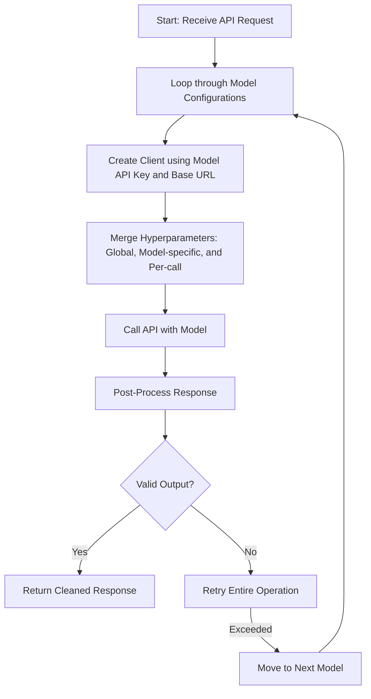

# simple-llm-openai-wrapper

**OpenAI Wrapper** is a highly configurable Python library designed to simplify your interactions with the OpenAI API. It addresses common challenges such as:

- **Multiple Model Fallbacks & Endpoints:**  
  Seamlessly try a list of models—even from different providers or endpoints. Each model can have its own API key, base URL, JSON enforcement flag, thinking tag removal flag, and hyperparameter defaults. Global settings act as fallbacks, except for `max_attempts`, which is applied globally.
- **Robust Retry Mechanism:**  
  Uses [tenacity](https://github.com/jd/tenacity) to automatically retry the entire API call _and_ its post-processing (e.g. JSON repair) for each model.
- **Output Post-Processing:**  
  Optionally repairs invalid JSON responses using [json_repair](https://pypi.org/project/json-repair/) and removes unwanted `<think>...</think>` sections.
- **Dual Interface:**  
  Supports both chat-style and text generation (completion) interactions using a unified API.

---

## Features

- **Per-Model Configuration:**  
  Each model configuration (provided as a dictionary) may include:
  - **model:** (required) The model name.
  - **api_key:** Model-specific API key (fallback to global if not provided).
  - **base_url:** Model-specific endpoint (fallback to global if not provided).
  - **json_only:** Whether to enforce valid JSON output via repair (overrides global).
  - **remove_thinking_sections:** Whether to remove `<think>...</think>` sections from the response (overrides global).
  - **default_params:** Model-specific hyperparameters (merged with global defaults and per-call parameters).

- **Retry on Failure (Including Post-Processing):**  
  The wrapper retries the complete process—including the API call and subsequent output validation/post-processing—up to a global `max_attempts` for each model before moving on.

- **Unified API Interface:**  
  Use the same wrapper to call both chat and completion endpoints.

---

## Installation

You can install **simple-llm-openai-wrapper** directly from GitHub using pip:

```bash
pip install git+https://github.com/ibivibiv/openai-wrapper.git
```

For example, to install the latest version from the `main` branch:

```bash
pip install git+https://github.com/ibivibiv/openai-wrapper.git@main
```

---

## Usage

Below is a quick example that demonstrates how to configure and use the library with per-model settings:

```python
from openai_wrapper.wrapper import OpenAIWrapper

# Global configuration with per-model overrides.
# Global values act as fallbacks if a model config does not supply its own.
config = {
    "models": [
        {
            "model": "gpt-4",
            "api_key": "your-gpt4-api-key",           # Overrides global API key for this model
            "base_url": "https://api.provider1.com/v1", # Overrides global base URL for this model
            "json_only": True,                         # Enforce JSON repair for this model
            "remove_thinking_sections": True,          # Remove <think>...</think> tags for this model
            "default_params": {"temperature": 0.6}       # Model-specific hyperparameters
        },
        {
            "model": "gpt-3.5-turbo",
            # Uses global API key and base_url if not provided.
            "json_only": True,                         # Enforce JSON repair for this model
            "remove_thinking_sections": False,         # Do not remove <think>...</think> tags for this model
            "default_params": {"temperature": 0.7}       # Model-specific hyperparameters
        }
    ],
    "api_key": "your-global-api-key",               # Global API key (fallback)
    "base_url": "https://api.openai.com/v1",          # Global base URL (fallback)
    "json_only": False,                             # Global JSON enforcement (overridden per model)
    "remove_thinking_sections": False,              # Global thinking tag removal (overridden per model)
    "default_params": {"max_tokens": 256},          # Global default hyperparameters
    "max_attempts": 3                               # Global retry attempts per model
}

client = OpenAIWrapper(config)

# Example 1: Chat-style request.
chat_messages = [
    {"role": "user", "content": "Tell me a <think>JSON</think> formatted joke about computers."}
]

try:
    chat_response = client.chat(chat_messages)
    print("Chat Response:")
    print(chat_response)
except Exception as e:
    print(f"Chat failed: {e}")

# Example 2: Completion-style request.
prompt = "Generate a JSON object describing a futuristic city with advanced technology."

try:
    gen_response = client.generate(prompt)
    print("\nGenerated Text:")
    print(gen_response)
except Exception as e:
    print(f"Generation failed: {e}")
```

---

## How It Works

The wrapper follows these steps for each API call:

1. **Model Selection, API Call, & Post-Processing with Retry:**  
   - For each model configuration, a client is created using the model's specific API key and base URL (falling back to the global settings when needed).
   - Hyperparameters are merged in this order: global defaults, model-specific defaults, and then any per-call parameters.
   - The API call (chat or completion) is made, and the output is immediately post-processed:
     - If enabled, `<think>...</think>` sections are removed.
     - If enabled, JSON repair is applied.
   - The complete operation—API call and post-processing—is wrapped in a retry mechanism (up to `max_attempts`), so that if any step fails (for example, if the JSON repair fails), it is retried.

2. **Fallback:**  
   - If the process fails for a given model after all retries, the wrapper moves on to the next model in the list until a successful response is obtained.

### Mermaid Diagram: Model Fallback with Full Retry



*Note: The diagram shows that if the output (including post-processing) is invalid, the entire operation is retried.*

---

## Contributing

Contributions are welcome! Please open issues or submit pull requests. When contributing, ensure that:
- Code follows the established style and includes tests.
- New features or bug fixes are documented in this README or in code comments.
- Any new external dependencies are added to the configuration files.

---

## License

This project is licensed under the [Apache 2.0 License](https://www.apache.org/licenses/LICENSE-2.0).

---

## Support

If you encounter issues or have suggestions, please open an issue on GitHub or contact the maintainers.

---

With this configuration, **simple-llm-openai-wrapper** lets you seamlessly work with models across multiple endpoints, with each model’s specific settings and a robust retry mechanism that covers the entire call process. Enjoy!
