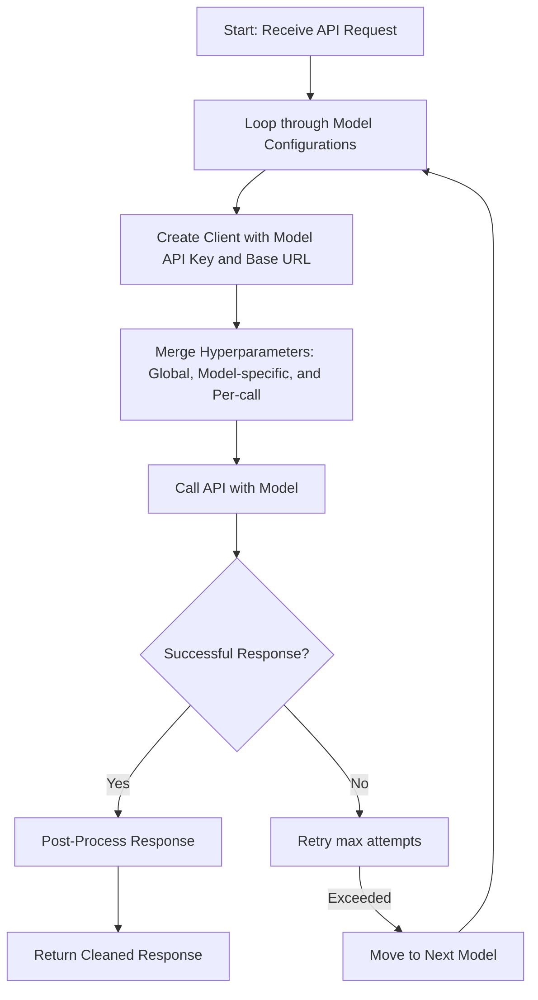

# simple-llm-openai-wrapper

**OpenAI Wrapper** is a highly configurable Python library designed to simplify your interactions with the OpenAI API. It addresses common challenges such as:

- **Multiple Model Fallbacks & Endpoints:** Seamlessly try a list of models—even from different providers or endpoints—so that if one fails, the next is attempted.
- **Robust Retry Mechanism:** Uses [tenacity](https://github.com/jd/tenacity) to automatically retry API calls for each model.
- **Output Post-Processing:** Optionally enforces valid JSON responses with [json_repair](https://pypi.org/project/json-repair/) and cleans up unwanted thinking sections (e.g., `<think>...</think>` tags).
- **Dual Interface:** Supports both chat-style and text generation (completion) interactions using a unified API.

---

## Features

- **Model Fallback with Custom Endpoints:**  
  Define a prioritized list of model configurations. Each model can have its own:
  - **API Key**
  - **Base URL/Endpoint**
  - **Hyperparameter Defaults**  
  This means you can mix models from different providers or endpoints within a single request.

- **Retry on Failure:**  
  Automatically retry API calls up to a configurable number of attempts per model.

- **JSON Enforcement:**  
  Optionally repair and enforce JSON output using `json_repair`.

- **Thinking Tag Removal:**  
  Optionally remove custom `<think>...</think>` sections from the API output.

- **Unified API Interface:**  
  Use the same wrapper to call both chat and completion endpoints.

---

## Installation

You can install **OpenAI Wrapper** directly from GitHub using pip:

```bash
pip install git+https://github.com/yourusername/openai-wrapper.git
```

For example, to install the latest version from the `main` branch:

```bash
pip install git+https://github.com/yourusername/openai-wrapper.git@main
```

---

## Usage

Below is a quick example that demonstrates how to configure and use the updated library with multiple endpoints:

```python
from openai_wrapper.wrapper import OpenAIWrapper

# Global configuration with per-model overrides.
config = {
    "models": [
        {
            "model": "gpt-4",
            "api_key": "your-gpt4-api-key",           # Model-specific API key (overrides global)
            "base_url": "https://api.provider1.com/v1", # Model-specific endpoint (overrides global)
            "default_params": {"temperature": 0.6}        # Model-specific hyperparameters
        },
        {
            "model": "gpt-3.5-turbo",
            # Uses global API key and base_url if not provided here.
            "default_params": {"temperature": 0.7}
        }
    ],
    "api_key": "your-global-api-key",               # Global API key
    "base_url": "https://api.openai.com/v1",          # Global base URL
    "json_only": True,                                # Enforce valid JSON output
    "remove_thinking_sections": True,                 # Remove <think>...</think> sections from responses
    "default_params": {"max_tokens": 256},            # Global default hyperparameters
    "max_attempts": 3                                 # Retry each model up to 3 times
}

client = OpenAIWrapper(config)

# Example 1: Chat-style request.
chat_messages = [
    {"role": "user", "content": "Give me a <think>JSON</think> object describing a futuristic vehicle."}
]

try:
    chat_response = client.chat(chat_messages)
    print("Chat Response:")
    print(chat_response)
except Exception as e:
    print(f"Chat failed: {e}")

# Example 2: Completion-style request.
prompt = "Write a JSON object that describes a new innovative gadget."

try:
    gen_response = client.generate(prompt)
    print("\nGenerated Text:")
    print(gen_response)
except Exception as e:
    print(f"Generation failed: {e}")
```

---

## How It Works

The wrapper operates in two main phases:

1. **Model Selection & Retry:**  
   For each API call (chat or generate), it cycles through your list of model configurations. For each model, it:
   - Constructs a new client using that model’s specific API key and endpoint (falling back to global settings if not provided).
   - Combines hyperparameters from global defaults, model-specific defaults, and per-call parameters.
   - Retries the API call (up to `max_attempts`) before moving on to the next model.

2. **Post-Processing:**  
   After a successful API call, the response is post-processed:
   - If enabled, `<think>...</think>` sections are removed.
   - If JSON enforcement is enabled, the response is repaired to produce valid JSON.

### Mermaid Diagram: Model Fallback with Multiple Endpoints



This diagram illustrates the flow: creating a client per model configuration, merging hyperparameters, attempting the API call with retries, and post-processing the response.

---

## Contributing

Contributions are welcome! Feel free to open issues or submit pull requests. When contributing, please ensure:
- Code follows the established style and includes tests.
- New features or bug fixes are documented in the README or code comments.
- Any external dependencies are added to the configuration files.

---

## License

This project is licensed under the [Apache 2.0 License](https://www.apache.org/licenses/LICENSE-2.0).

---

## Support

If you encounter any issues or have suggestions, please open an issue on GitHub or contact the maintainers.


---
